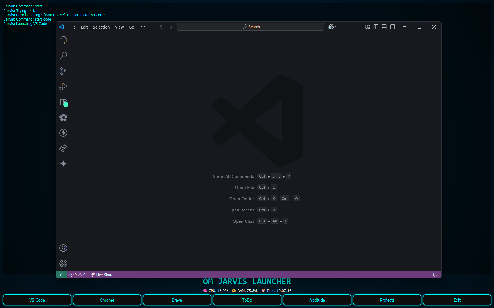

# 🤖 Om Jarvis Launcher

<p align="center">
  <strong>A Voice-Controlled AI Assistant with GUI built using Python & PyQt5</strong><br>
  <em>Inspired by Tony Stark's JARVIS from the Marvel universe</em>
</p>

---

## 🌌 Features

### 🎤 Voice Commands
- **🎙️ Wake Word Activation** — Say "Jarvis" followed by your command
- **🚀 Application Launching** — Open Chrome, Brave, VS Code, WhatsApp, Telegram, and more
- **⚙️ System Control** — Shutdown, lock screen, volume control
- **📊 Information Services** — Get current time, weather updates, system stats
- **🎭 Entertainment** — Tell jokes, open YouTube, Spotify

### 🖥️ GUI Interface
- **✨ Modern Dark Theme** — Cyan accents with glowing effects
- **📈 Real-time Monitoring** — Live CPU, RAM, and time display
- **🔘 Quick Access Buttons** — Launch frequently used applications
- **💬 Interactive Chat Log** — Shows voice command interactions
- **🖼️ Fullscreen Design** — Frameless window with radial gradient background

### 📊 System Monitoring
- Real-time CPU usage percentage
- RAM usage monitoring  
- Current time display
- Updates every second

---

## 🚀 Screenshot

> *Add a screenshot of your application here*
> 

---

## 🔧 Installation & Setup

### Prerequisites
- **Operating System**: Windows (paths are Windows-specific)
- **Python**: 3.6 or higher
- **Microphone**: Required for voice commands
- **Internet Connection**: Required for weather updates and speech recognition

### 1. Install Required Packages

```bash
pip install PyQt5 pyttsx3 psutil speech-recognition requests
```

### 2. Optional Dependencies
- **NirCmd**: For volume control commands (download from [NirSoft](https://www.nirsoft.net/utils/nircmd.html))

### 3. Configure Weather API (Optional)
1. Get a free API key from [OpenWeatherMap](https://openweathermap.org/api)
2. Replace `"your_openweather_api_key"` in line 48 with your actual API key
3. Modify the city name in line 49 if needed

### 4. Update Application Paths
- Modify the file paths in the `buttons` list (lines 107-113) to match your system
- Update voice command paths in the `handle_voice_command` method

---

## 🎮 Usage

### Running the Application
```bash
python om_jarvis_launcher.py
```

### 🗣️ Voice Commands

After launching, the application will say *"Jarvis online and awaiting your orders, Sir."* You can then use these voice commands:

#### 🚀 Application Launching
- **"Jarvis, open Chrome"** — Opens Google Chrome
- **"Jarvis, open Brave"** — Opens Brave browser  
- **"Jarvis, open VS Code"** — Launches Visual Studio Code
- **"Jarvis, open projects"** — Opens the projects folder
- **"Jarvis, open WhatsApp"** — Launches WhatsApp
- **"Jarvis, open Telegram"** — Opens Telegram
- **"Jarvis, open todo"** — Opens your to-do list
- **"Jarvis, open aptitude"** — Opens aptitude notes

#### 🌐 Web Services
- **"Jarvis, open YouTube"** — Opens YouTube in default browser
- **"Jarvis, play music"** or **"Jarvis, Spotify"** — Opens Spotify

#### ⚙️ System Control
- **"Jarvis, shutdown"** — Shuts down the computer (5-second delay)
- **"Jarvis, lock screen"** — Locks the workstation
- **"Jarvis, volume up"** — Increases system volume
- **"Jarvis, volume down"** — Decreases system volume

#### 📊 Information
- **"Jarvis, what's the time?"** — Announces current time
- **"Jarvis, weather"** — Gets weather information for configured city
- **"Jarvis, tell me a joke"** — Tells a random programming joke

#### 🔚 Application Control
- **"Jarvis, exit"** or **"Jarvis, quit"** — Closes the launcher

### 🖱️ GUI Controls
- Click any button to launch the corresponding application
- System information updates automatically in real-time
- Chat log shows all voice command interactions
- Press Alt+F4 or use voice command to exit

---

## ⚙️ Configuration

### 🔧 Customizing Application Paths
Edit the `buttons` list in the `init_ui` method (lines 106-114):
```python
buttons = [
    ("App Name", lambda: self.launch_app("path/to/your/app.exe")),
    # Add more applications here
]
```

### 🎤 Adding New Voice Commands
Add new voice commands in the `handle_voice_command` method (lines 159-215):
```python
elif "your command" in command:
    self.respond_and_launch("Response text", "path/to/app.exe")
```

### 🔊 Voice Settings
Modify voice properties in lines 17-21:
```python
engine.setProperty('rate', 170)      # Speech rate
engine.setProperty('volume', 1.0)    # Volume level
engine.setProperty('voice', voices[1].id)  # Voice selection (0=male, 1=female)
```

---

## 📁 File Structure
```
mini-jarvis/
├── om_jarvis_launcher.py    # Main application file
├── README.md               # Documentation
└── requirements.txt        # Python dependencies (optional)
```

---

## 🔧 Troubleshooting

### Common Issues

#### 🎤 Voice Recognition Not Working
- Check microphone permissions in Windows settings
- Ensure stable internet connection for Google Speech Recognition
- Speak clearly and wait for the listening timeout (5 seconds)
- Try reducing background noise

#### 🚀 Applications Not Launching
- Verify application paths are correct for your system
- Check if applications are installed in specified locations
- Run the launcher as administrator if needed
- Update paths in the code to match your installation directories

#### 🌦️ Weather Not Working
- Ensure you have a valid OpenWeatherMap API key
- Check internet connection
- Verify city name is spelled correctly
- API key should be active (may take a few minutes after registration)

#### 📦 Import Errors
- Install missing packages: `pip install <package-name>`
- Ensure Python version is 3.6 or higher
- Try using `pip3` instead of `pip` on some systems

### 🚀 Performance Tips
- Close unnecessary applications to improve voice recognition response time
- Ensure stable internet connection for optimal speech recognition
- Speak clearly with a moderate pace
- Avoid background noise during voice commands
- Keep the microphone at an appropriate distance

---

## 🤝 Contributing

Feel free to contribute by:
- 🆕 Adding new voice commands
- 🎨 Improving the GUI design
- ✨ Adding new features
- 🐛 Fixing bugs
- 📚 Updating documentation
- 🔧 Optimizing performance

### How to Contribute
1. Fork the repository
2. Create a feature branch
3. Make your changes
4. Test thoroughly
5. Submit a pull request

---

## 📄 License

This project is open source. Feel free to modify and distribute according to your needs.

---

## 🙏 Acknowledgments

- **Inspiration**: Tony Stark's JARVIS from the Marvel Cinematic Universe
- **GUI Framework**: PyQt5 for the beautiful interface
- **Speech Recognition**: Google Speech Recognition API
- **Text-to-Speech**: pyttsx3 library
- **Weather Data**: OpenWeatherMap API
- **System Monitoring**: psutil library

---

## 📞 Support

If you encounter any issues or have questions:
1. Check the troubleshooting section above
2. Ensure all prerequisites are met
3. Verify your system paths are correctly configured
4. Test with simple voice commands first

---

**Note**: This application is designed for Windows systems. Paths and some system commands may need modification for Linux or macOS.

---

<p align="center">
  <strong>🌟 Enjoy your personal AI assistant! 🌟</strong>
</p>